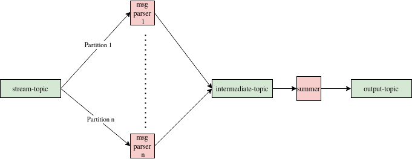

# Doodle Data Challenge

This is my submission for the Doodle Data Engineer role.

## Installation and running

I am using version Kafka version `2.6.3` and Zookeeper version `3.6.3`.
For the implementation of the business functionality, I decided
to use Python `3.8`. I did this because I feel that I am strong in
this language, as well as the fact that Python has a kafka driver
(`kafka-python`), and the latest version that it supports is `3.8`.
Make sure that you also have `pipenv` installed.

First, start up kafka and zookeeper, and have them run on the default
localhost ports. This is needed for the tests as well.

To enter the environment needed to run this code, simply write

```shell
$ pipenv shell
```

to enter and install the Python `3.8` venv. There might be an error
with `pipenv`, so if there is, run

```shell
$ pipenv --python 3.8
```

Once inside, run

```shell
$ pip install -r requirements.txt
```

to install the requirements to run the code.

All the logic in the code can be found in the `process_messages.py` file, which
can be run by running `python process_messages.py`. There are several arguments
one can enter; to see the full list of them, simply write `python
process_messages.py --help`. One thing to note in particular is that this
implementation can read from a file with the `--input_file` parameter.

Also, when reading from kafka, one can press ctrl-c at any point and the service
will stop reading and send what it has processed immediately to the producer and
shut down.

Note that this assumes your kafka and zookeeper are running on localhost with
the default port config.

## What was done

At a high level, what was done was a version of MapReduce for the incoming
messages. Messages were read in a batch from the consumer, the data was
processed (extrated the `uid` and the `ts`), and then once the data was ready
to send, was sent off to the producer.

I tried to get this working in a stateless fashion, such that recovery
procedures would be easy. In particular, I wanted to make this system
resillient to crashes, such that it would pick up as easily as possible from a
crash.

### Reading from the consumer

The messages were polled from the consumer in batch. I found that an ideal
batch size was around 1000, as I ran several benchmark tests (all reproducable
in the `benchmark_commands.md` file). These benchmarks gave me the following
frames per second for different batch sizes:

- 100: 13089.6
- 250: 17838.6
- 500: 18510.4
- 1000: 19223.5
- 2000: 19207.6

After the messages were polled, I looped through each frame and parsed the json
string, from which I extracted the timestamp and the uid. I wanted to only
parse the json string once, as per my time analysis in the code (again, can be
found in the `benchmark_commands.md` file), the json parsing took the most time
in total when reading the message. In particular, per message read (for the
1000 batch size run), I found that with a total computation time of 3.264e-05
seconds, the json parsing took 3.148e-05 seconds, or about 96% of the total
time.

Here, I measuered the time using the difference in time using Python's
`time.time()` command. I would do this differently in prod, such as keeping a
metric of this and reporting the 50th and 95th time percentiles in grafana,
making an alert if the time got too large.

### Choosing a suitable data structure to count unique users

Since our goal was to count the number of unique users per minute, I needed
some way to link the two. I decided to store the user data in the following
data structure:

```python
unique_users_per_min = {minute_ts : Set(users)}
```

where `minute_ts = floor(original_ts/60)`. This means that all frames have a direct
one to one mapping from their second timestamp to their minute timestamp, making it
an easy way to organize the events that come in.

I chose this data structure because it seemed to be the easiest way to map the
second timestamps to the minute timestamps, and the best way to organize the
unique users per minute.

Note that a set's elements do not repeat. So all users per minute are unique.

### Polling the consumer

After the consumer is polled, I process the polled frames into the above data
structure and then store them in a variable, which will then send it to the
producer over multiple poll loops once certain conditions, which I outline
below, are met. In particular, this global variable, which I call
`unique_users_per_min` in my code, keeps track of the set of users over
multiple polls.

### Sending Data to the producer

For a saved message `(min_ts, users)` (possibly aggregated over multiple poll
loops), it is sent if the latest message from the latest poll (whose timestamp
is defined by `latest_timestamp_from_poll_loop`) is more than 5 seconds after
the maximum possible second value of `min_ts` (since `min_ts` is already in
minutes). This is because, as mentioned previously, our saved timestamp is
floored, so all values between `[sec_ts*60, sec_ts*60+60)` could have been
mapped to `min_ts` (where `sec_ts = min_ts*60`). I do this due to the latency
assumption mentioned in the challenge.

So, in a formulaic way, our message is sent if `min_ts*60 + 65 < latest_timestamp_from_poll_loop`.

Also, the message that is sent is a json string as follows:

```json
{
  "ts": min_ts,
  "n_users": len(users)
}
```

This data point then gets deleted from the local memory of the program, meaning
it won't be sent again when this is strictly ordered. I deal with the unordered
case further down, where a simple extension of this is possible to not send
duplicate messages.

I chose this method of sending the message because it is stateless and only relies
on the incoming messages, and not from any outside factors like current time.

I made sure the message was sent using this command:

```
./bin/kafka-console-consumer.sh --bootstrap-server localhost:9092 \
--topic output-topic --from-beginning --max-messages 100
```

See the next section about when I don't send messages (filter out outliers).

### Detecting outliers

The outlier detection method that I use is rather simple: I do not send any
frames that have only one unique user for a given timestamp. My reasoning on
this is that I believe that there will be lots of users that use this service
due to the amount of data that was on the topic, and that there will never be
one unique user per minute on this topic. Also, if there is a bit flip error,
the number that it will flip to will most likely not show up again in the
message stream.

If there is not enough data on this topic (the assumption above doesn't hold),
we can have another service that sends a small amount of frames every minute to
this topic (let's say 5), and then our service could subtract that same number
when sending it further to the producer.

There are several ways to remove this data from process memory if it is indeed false,
one of which is to have a counter for how many times this timestamp was attempted to be
sent, and if this number gets too high, simply delete it from memory.

## Other points of consideration

Here are some further points of consideration if one were to scale this app/launch to prod.

### Testing and other files that comes with this repo

I made some simple unit tests to check if my code is correct. In particular, I
took the first 100 messages (using `head -n 100`), and made sure that these
messages were processed correctly. I also simulated a bitflip, and made sure
that this bit flipped message didnt send.

One can run these tests by running `pytest` from the top dir.

Some additional files:

- `useful_commands.md`: Some useful testing commands for kafka and setup
- `benchmark_commands.md`: Commands I used for benchmarking

Finally, all python files were styled using the following command: `isort .;
black .`.

### How to scale

If this system were to receive orders of magnitude more data, this would need to scale.
I propose the following changes:

- Increase the number of partitions on the Kafka topic (call it `n`).
- Increase the number of processes of `process_messages.py` to `n`, and have
  each process read from its own partition.
- Instead of `process_messages.py` sending to an output, send it to an
  intermediate topic that will send it to another process that acts as a
  barrier, counting the number of timestamps that come in for a given minute.
  In addition, `process_messages.py` will send `{min_ts: Set(users)}` instead
  of `{min_ts: len(users)}`, since a user can possibly be on multiple
  partitions.
- The final process will combine all sets of users from all partitions for a
  given timestamp.
- Once the final process gets `n` messages for a timestamp, send `{min_ts:
  len(all_users_from_all_partitions)}` to the output topic.

A diagram of this is shown here. Note that the red message processing machines
are what we have now, the green rectangles are kafka topics, and the red
machine on the right is the summer/barrier:



I scaled it this way because the `process_messages.py` file will have a lot
more load than the final process (more JSON deserializaiton, more incoming
messages vs. around `n` per minute for the last process), and this load is
easily scalable. So, I make more of these processes to distribute the work more
evenly.

### Fault Tolerance

A property that this code has is that if the program crashes at any point, it
will be able to pick up where it left off if it started again, due to the poll
and commit structure of my poll loop. That is, there is a poll, the processing
is done, and then, after the messages are sent to the producer, the changes are
then commited.

However, on a restart, there is a possibility of two errors:

- There is an inaccurate count of the number of unique users in a given minute
- A given timestamp can be sent twice

These errors would only last for a timestamp or two max, and they would not
happen that often if this was launched on a stable cloud VM instance. So, I
considered this an acceptable loss for a machine that will most likely
constantly be running.

### Parsing Improvements

Currently, parsing/unparsing with JSON is the bottleneck in our MapReduce
implementation, as per my individual message time analysis. What would be a
better way of unparsing and parsing the messages again is with AVRO. All
services would get a predefined schema and would be able to read the messages
based on this schema. This has the following advantages:

- Faster parsing and unparsing
- Messages take up less space
- Less chance for encoding issues

AVRO deals with these issues better than JSON.

### Estimated Error

Because I send messages for a given minute `m` when I first get another frame
that has a timestamp 5 seconds later than the maximum possible value that can
map to `m`, and since we have a guarantee from the challenge description that
99.9% of frames come within 5 seconds, this means that the maximum counting
error that my method has is less than or equal to 0.01%.

### Final Remarks

One final remark that I want to mention is that with my method, there is a
possibility that messages are sent twice (due to the possibility of a message
arriving, let's say, 15 seconds late). In this case, a possible mitigation
strategy is to keep a database for this service that stores which values
were already sent, and check every time that a message is sent, that it
does not already appear here. This would most likely not incur much more
overhead, since this database would not contain many values and a check
would only be done once the data is sent.

Also, in the code, there are some comments noting when I would use a different
service (like Grafana) if this was launched in a prod environment.
